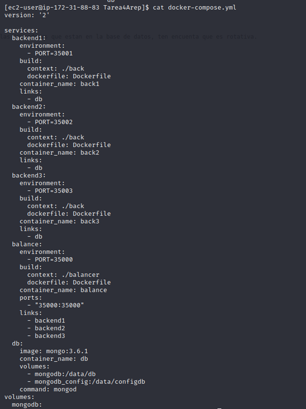

# Arep Tarea 4

### Autor: Juan Sebastian Ospina  -Fecha:  03/15/2022

## **Arepa Tarea 4**

En este proyecto lo que se plantea es hacer una aplicacion web que montada en AWS
haciendo uso de un EC2 y Docker para contenedores de las mismas. se va hacer uso de un balanceador de cargas tipo **RoundRobin**
este sera el unico con puertos abiertos y mapeados de docker a la maquina y con permisos en los grupos de seguridad de aws para que se pueda entrar al mismo, va a correr por el puerto 35000, este redirecciona el flujo usando algoritmo **RoundRobin** a 3 conexiones con una base de datos mongoDB estos 4 van a estar en contenedores dentro de docker, a continuacion se deja una imagen para explicar

Para aprovechar el poder de docker lo que se hace es en el docker compose vamos a tener la misma imagen para las 3 conexiones a la base de datos, solo vamos a cambiar el puerto por el que corre  y el nombre, ya que estas no van a necesitar conexiones fuera de docker lo que hacemos es no mapear sus puertos y dejarlos solo internos, el MongoDB es una imagen y solo aclaramos que debe descargarla del repositorio de dockerhub, y por ultimo creamos la imagen para el balanceador de cargas este si esta mapeadao al puerto 3500 de la maquina para poder darle salida, como se puede ver a continuacion.

Vamos a ver como se ejecuta este docker compose y como quedan los contenedores en ejecucion

Para enviarlo a la maquina en AWS lo que hice fue enviarlo por sftp un zip descomprimir y ejecutar el docker-compose, no olvidar abrir los puertos en el grupo de seguridad de la maquina en este caso como se ve en el diagrama solo hace falta abrir el 35000

Ya que esta ejecutando entramos a la pagina web y verificamos el funcionamiento, teniendo encuenta que debe estar maximo 10 guardados en la base de datos y sale la fecha y la cadena.

Apreciamos el correcto funcionamiento de la aplicacion corriendo en AWS y todo su funcionamiento perfecto.

Para finalizar revisamos que el balanceador de cargas esta trabajando y esto lo hice con un print en el mismo que me diga por que direccion esta enviando la peticion y para esto abrimos el log del contenedor.

